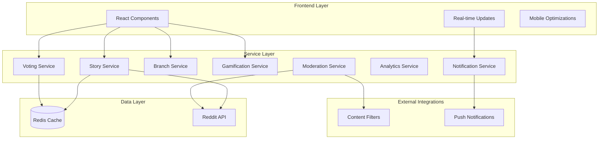
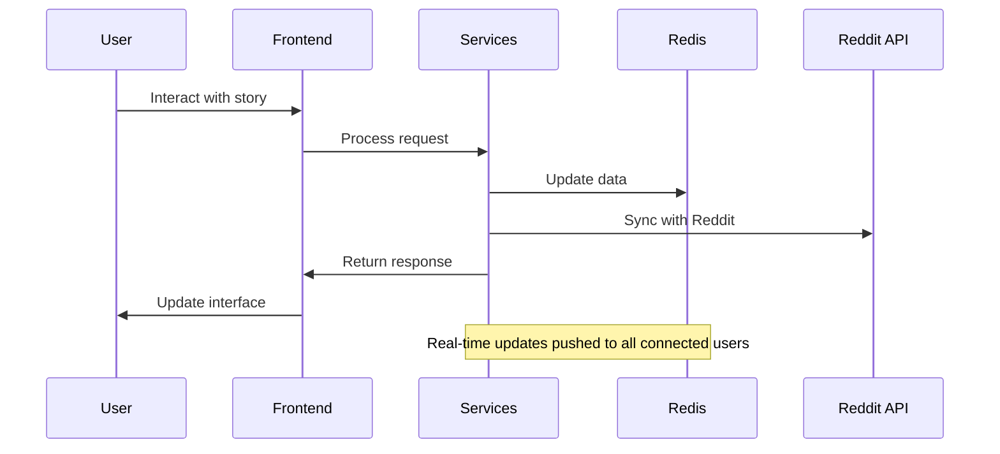

# Design Document

## Overview

This design document outlines the technical architecture for enhancing the StoryWeave Reddit Devvit application. The enhancements will transform the basic collaborative storytelling platform into a comprehensive community engagement tool with advanced features including sophisticated voting systems, branching narratives, real-time collaboration, gamification, and comprehensive moderation tools.

The design builds upon the existing TypeScript/React architecture while introducing new services, data models, and user interface components to support the enhanced functionality. The system will maintain Reddit API compliance and leverage Redis for efficient data storage and real-time features.

## Architecture

### High-Level System Architecture



### Component Architecture

The application will be structured with a modular component architecture:

- **Core Components**: Enhanced story management and display
- **Interactive Components**: Advanced voting, branching, and real-time features  
- **Moderation Components**: Content filtering and community management
- **Analytics Components**: Insights and reporting dashboards
- **Mobile Components**: Touch-optimized interfaces

### Data Flow Architecture



## Components and Interfaces

### Enhanced Data Models

#### Extended Story Interface
```typescript
interface EnhancedStory extends Story {
  category: StoryCategory;
  description: string;
  estimatedDuration: number;
  progressPercentage: number;
  trendingScore: number;
  moderationStatus: ModerationStatus;
  crossPostData: CrossPostData[];
  analytics: StoryAnalytics;
}

interface StoryCategory {
  id: string;
  name: string;
  description: string;
  template?: StoryTemplate;
}

interface StoryTemplate {
  prompts: string[];
  suggestedTags: string[];
  maxSentences?: number;
  branchingRules: BranchingRule[];
}
```

#### Advanced Voting System
```typescript
interface WeightedVote {
  userId: string;
  weight: number;
  timestamp: number;
  voteType: 'upvote' | 'downvote' | 'quality' | 'creative';
}

interface VotingMetrics {
  totalVotes: number;
  weightedScore: number;
  qualityRating: number;
  controversyScore: number;
  moderatorOverride?: boolean;
}
```

#### Branching System
```typescript
interface StoryBranch extends StoryBranch {
  parentBranchId?: string;
  childBranches: string[];
  popularity: number;
  mergeCandidate: boolean;
  branchType: 'decision' | 'alternative' | 'experimental';
  votingDeadline?: number;
}

interface BranchingRule {
  triggerCondition: string;
  maxBranches: number;
  votingPeriod: number;
  mergeThreshold: number;
}
```

#### Gamification System
```typescript
interface UserProfile {
  userId: string;
  username: string;
  reputation: number;
  level: number;
  badges: Badge[];
  achievements: Achievement[];
  statistics: UserStatistics;
  preferences: UserPreferences;
}

interface Badge {
  id: string;
  name: string;
  description: string;
  iconUrl: string;
  rarity: 'common' | 'rare' | 'epic' | 'legendary';
  earnedAt: number;
}

interface Achievement {
  id: string;
  name: string;
  description: string;
  progress: number;
  maxProgress: number;
  reward: AchievementReward;
}
```

### Service Interfaces

#### Enhanced Story Service
```typescript
interface IEnhancedStoryService {
  // Core story operations
  createStory(params: CreateStoryParams): Promise<EnhancedStory>;
  getStory(storyId: string, includeAnalytics?: boolean): Promise<EnhancedStory | null>;
  searchStories(query: SearchQuery): Promise<SearchResult<EnhancedStory>>;
  
  // Advanced features
  getTrendingStories(subredditName: string, timeframe: TimeFrame): Promise<EnhancedStory[]>;
  getStoriesByCategory(category: StoryCategory, filters: StoryFilters): Promise<EnhancedStory[]>;
  archiveInactiveStories(cutoffDate: number): Promise<string[]>;
}
```

#### Voting Service
```typescript
interface IVotingService {
  castWeightedVote(params: WeightedVoteParams): Promise<VotingResult>;
  calculateUserWeight(userId: string, subredditName: string): Promise<number>;
  getVotingMetrics(sentenceId: string): Promise<VotingMetrics>;
  handleMultipleSubmissions(storyId: string, submissions: SentenceSubmission[]): Promise<VotingSession>;
}
```

#### Branch Management Service
```typescript
interface IBranchService {
  createBranch(params: CreateBranchParams): Promise<StoryBranch>;
  getBranchTree(storyId: string): Promise<BranchTree>;
  voteBranchMerge(branchId: string, userId: string, approve: boolean): Promise<boolean>;
  mergeBranch(branchId: string, targetBranchId: string): Promise<MergeResult>;
}
```

### User Interface Components

#### Enhanced Story Builder
```typescript
interface StoryBuilderProps {
  story: EnhancedStory;
  currentBranch?: string;
  realTimeUsers: ActiveUser[];
  onSentenceSubmit: (sentence: string, branchId?: string) => Promise<void>;
  onBranchCreate: (params: BranchCreationParams) => Promise<void>;
  onVote: (sentenceId: string, voteType: VoteType) => Promise<void>;
}
```

#### Real-time Collaboration Panel
```typescript
interface CollaborationPanelProps {
  activeUsers: ActiveUser[];
  typingIndicators: TypingIndicator[];
  recentActivity: ActivityEvent[];
  onUserInteraction: (interaction: UserInteraction) => void;
}
```

#### Moderation Dashboard
```typescript
interface ModerationDashboardProps {
  flaggedContent: FlaggedContent[];
  moderationQueue: ModerationItem[];
  communityRules: CommunityRule[];
  onModerationAction: (action: ModerationAction) => Promise<void>;
}
```

## Data Models

### Redis Storage Schema

#### Enhanced Story Storage
```
story:{storyId} -> EnhancedStory JSON
story:{storyId}:branches -> Set of branch IDs
story:{storyId}:analytics -> StoryAnalytics JSON
story:{storyId}:realtime -> Real-time session data
```

#### User Data Storage
```
user:{userId}:profile -> UserProfile JSON
user:{userId}:reputation -> Reputation score
user:{userId}:achievements -> Set of achievement IDs
user:{userId}:activity -> Recent activity log
```

#### Community Data Storage
```
subreddit:{name}:stories:active -> Sorted set by activity
subreddit:{name}:stories:trending -> Sorted set by trending score
subreddit:{name}:leaderboard -> Sorted set by reputation
subreddit:{name}:moderation -> Moderation settings and rules
```

#### Real-time Data Storage
```
realtime:story:{storyId}:users -> Set of active user IDs
realtime:story:{storyId}:typing -> Hash of typing indicators
realtime:notifications:{userId} -> List of pending notifications
```

### Content Filtering and Moderation

#### Automated Content Filtering
```typescript
interface ContentFilter {
  id: string;
  name: string;
  pattern: RegExp | string;
  severity: 'low' | 'medium' | 'high' | 'critical';
  action: 'flag' | 'hide' | 'reject' | 'escalate';
  subredditSpecific: boolean;
}

interface ModerationAction {
  id: string;
  moderatorId: string;
  contentId: string;
  action: 'approve' | 'reject' | 'edit' | 'warn' | 'ban';
  reason: string;
  timestamp: number;
  appealable: boolean;
}
```

## Error Handling

### Comprehensive Error Management

#### Service-Level Error Handling
```typescript
class StoryServiceError extends Error {
  constructor(
    message: string,
    public code: ErrorCode,
    public context?: Record<string, any>
  ) {
    super(message);
    this.name = 'StoryServiceError';
  }
}

enum ErrorCode {
  STORY_NOT_FOUND = 'STORY_NOT_FOUND',
  INVALID_PERMISSIONS = 'INVALID_PERMISSIONS',
  CONTENT_VIOLATION = 'CONTENT_VIOLATION',
  RATE_LIMIT_EXCEEDED = 'RATE_LIMIT_EXCEEDED',
  REDIS_CONNECTION_ERROR = 'REDIS_CONNECTION_ERROR',
  REDDIT_API_ERROR = 'REDDIT_API_ERROR'
}
```

#### User-Facing Error Messages
```typescript
interface ErrorMessage {
  code: ErrorCode;
  userMessage: string;
  technicalMessage: string;
  suggestedAction?: string;
  retryable: boolean;
}
```

### Fallback Mechanisms

- **Offline Mode**: Cache critical data for offline reading
- **Graceful Degradation**: Disable advanced features if services fail
- **Retry Logic**: Automatic retry for transient failures
- **Circuit Breaker**: Prevent cascade failures in service dependencies

## Testing Strategy

### Unit Testing Approach

#### Service Testing
```typescript
describe('EnhancedStoryService', () => {
  describe('createStory', () => {
    it('should create story with proper validation', async () => {
      // Test story creation with all required fields
    });
    
    it('should handle duplicate story titles gracefully', async () => {
      // Test duplicate handling
    });
    
    it('should apply category templates correctly', async () => {
      // Test template application
    });
  });
});
```

#### Component Testing
```typescript
describe('StoryBuilder', () => {
  it('should display real-time typing indicators', () => {
    // Test real-time features
  });
  
  it('should handle branch creation workflow', () => {
    // Test branching functionality
  });
  
  it('should validate sentence submissions', () => {
    // Test input validation
  });
});
```

### Integration Testing

#### Reddit API Integration
- Test all Reddit API endpoints with proper error handling
- Validate permission checks and rate limiting
- Test cross-posting functionality

#### Real-time Features Testing
- Test WebSocket connections and message delivery
- Validate typing indicators and live updates
- Test concurrent user interactions

### End-to-End Testing

#### User Workflows
- Complete story creation and participation flow
- Branching and merging workflows
- Moderation and content filtering workflows
- Mobile user experience testing

#### Performance Testing
- Load testing with multiple concurrent users
- Redis performance under high load
- Mobile performance optimization validation

### Accessibility Testing

#### Compliance Testing
- Screen reader compatibility testing
- Keyboard navigation testing
- Color contrast and visual accessibility
- Motor impairment accommodation testing

## Performance Considerations

### Optimization Strategies

#### Frontend Optimizations
- React.memo for expensive components
- Lazy loading for story lists and branches
- Virtual scrolling for long story content
- Debounced input for real-time features

#### Backend Optimizations
- Redis connection pooling
- Efficient data structures for voting and analytics
- Caching strategies for frequently accessed data
- Background processing for heavy operations

#### Mobile Optimizations
- Touch-optimized interface elements
- Reduced data transfer for mobile connections
- Progressive loading of story content
- Offline caching for critical functionality

### Scalability Design

#### Horizontal Scaling
- Stateless service design for easy scaling
- Redis clustering for data distribution
- Load balancing for high availability
- CDN integration for static assets

#### Data Management
- Efficient Redis key patterns for fast lookups
- Data archiving strategies for old stories
- Analytics data aggregation and summarization
- Backup and recovery procedures